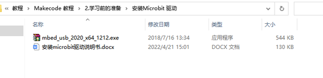

# BBC Miciro:bt和Makecode

## 第1小节 Micro:bit主板的介绍

Micro:bit主板是英国广播公司设计的，旨在帮助7年级（11-12岁）及以上的孩子更好地学习编程。Micro:bit主板拥有丰富的板资源，包括一个5\*5 LED点阵、2个可编程按钮、指南针、Micro USB端口、蓝牙模块等。它只有信用卡一半大小(4cm×5cm)，但功能非常强大。它可以用于编写电子游戏，声光互动，机器人控制，科学实验，可穿戴装置开发等，可以实现任何酷炫的小发明，无论是机器人还是乐器，没有做不到只有想不到。

新款的Micro:bit V2.2主板上有一个可触摸感应的Logo和MEMS麦克风。背面还添加了一个蜂鸣器，这样就可以在没有外部设备的情况下播放各种声音。底部的金手指加上齿轮设计，方便用户更好地固定鳄鱼夹。此外，Micro:bit V2.2主板还支持休眠模式，用户可以长按Micro:bit V2.2主板后面的复位&电源按钮，使其进入睡眠模式，降低电池功耗。最重要的特点是Micro:bit V2.2主板的CPU性能比V1.5版本好得多，外加更多的RAM。所以Micro:bit V2.2允许用户扩展更多的功能，创造更多的创意作品。

（2）Micro:bit主板硬件分布图介绍：

Micro:bit V2.2主板

有关更多内容，请参阅：[<u>https://tech.microbit.org/hardware/</u>](https://tech.microbit.org/hardware/)

<https://microbit.org/new-microbit/>

[<u>https://www.microbit.org/get-started/user-guide/overview/</u>](https://www.microbit.org/get-started/user-guide/overview/)

[<u>https://microbit.org/get-started/user-guide/features-in-depth/</u>](https://microbit.org/get-started/user-guide/features-in-depth/)

（3）Micro:bit引脚配置介绍，如下图所示：

Micro:bit引出的引脚中，其引脚功能分类如下表所示：

|GPIO|P0，P1，P2，P3，P4，P5，P6，P7，P8，P9，P10，P11，P12，P13，P14，P15，P16，P19，P20|
|-|-|
|ADC/DAC|P0，P1，P2，P3，P4，P10|
|IIC|P19（SCL），P20（SDA）|
|SPI|P13（SCK），P14（MISO），P15（MOSI）|
|PWM（常用）|P0，P1，P2，P3，P4，P10|
|PWM（不常用）|P5、P6、P7、P8、P9、P11、P12、P13、P14、P15、P16、P19、P20|
已占用|P3(LED Col3)，P4(LED Col1)，P5(Button A)，P6(LED Col4)，P7(LED Col2)，P10(LED Col5)，P11(Button B)|

详细信息请参考官方网站：[<u>https://tech.microbit.org/hardware/edgeconnector/</u>](https://tech.microbit.org/hardware/edgeconnector/)

https://microbit.org/guide/hardware/pins/

（4）新款Micro:bit V2.2主板使用注意事项：

- a. Micro:bit V2.2主板上有很多精密的电子元件，建议戴上硅胶保护套进行使用，防止短路。

- b. Micro:bit   V2.2主板的IO口驱动能力很弱，IO口电流不足300mA，请勿接大电流器件（例如大舵机MG995、直流电机），否则会烧坏Micro:bit   V2主板，使用前必须完全了解清楚你所使用的器件电流情况，一般建议配搭Micro:bit扩展板进行使用。

- c. 供电建议从Micro:bit   V2.2主板的USB口进行供电，或者Micro:bit   V2.2主板上的3V电池座接口。Micro:bit   V2.2主板本身IO口是3V电平，所以是不支持5V传感器的，如需支持5V传感器需要使用 Micro:bit扩展板。

- d. 使用与Micro:bit   V2.2主板LED点阵的共用引脚（如P3、P4、P6、P7、P10），记得在代码中把LED点阵禁用掉，否则会有LED点阵显示杂乱和可能让所接传感器数据出错的现象。

- e.   3V电池座接口上不能使用超过3.3V电池，否则很容易会把Micro:bit   V2.2主板烧坏。

- f. 禁止放在金属制品上使用，以免发生短路。

总结：Micro:bit V2.2主板就像是一台微型计算机，它使编程变得有形，并促进数字创造力。关于编程环境，BBC提供了一个在线编程网站：<https://microbit.org/code/>，该网站有一个易于使用的图形化程序MakeCode。

## 第2小节 Micro:bit驱动安装说明：

如果你已经安装过micro:bit
驱动，就不需要再次安装micro:bit驱动。假如你是首次使用micro:bit主板，则你的电脑需要安装micro:bit驱动，我们提供的micro:bit驱动文件

和micro:bit驱动安装手册都在文件夹“安装Micro:bit
驱动”里面，你可以进入相关文件夹中根据说明书进行安装。

## 第3小节 快速开始

以下的步骤说明基于Windows操作系统，如果你使用的是其他操作系统，可以将其作为参考。

（1）代码与编程

本节介绍如何为micro：bit编写程序以及如何将其下载到micro：bit。
micro：bit官方网站上有非常详细的教程，
您可以参考：[<u>Https://microbit.org/guide/quick/</u>](https://microbit.org/guide/quick/)

Step 1: 连接micro：bit

通过Micro USB线将micro：bit连接到电脑，

micro:bit主板背后的红色LED会显示，表明micro:bit主板有电了。

Micro:bit
将在您的电脑上显示为一个名为'MICROBIT'的驱动器。但请注意，它不是普通的USB磁盘！如下图：

Step 2: 编写程序

在浏览器中访问链接：<https://makecode.microbit.org/>，然后单击“新建项目”，出现“创建项目”对话框，在对话框中输入“heartbeat”，单击“创建”并开始编程。

如果你的电脑具有Windows 10操作系统，则还可以使用Windows 10 App进行编程，这与在浏览器上进行编程完全相同:
[https://www.microsoft.com/zh-cn/p/makecode-for-micro-bit/9pjc7sv48lcx?ocid=badgep&rtc=1&activetab=pivot:overviewtab](https://www.microsoft.com/zh-cn/p/makecode-for-micro-bit/9pjc7sv48lcx?ocid=badgep&rtc=1#activetab=pivot:overviewtab)

（以下是以Google Chrome为例，其他浏览器类似）

如果你的编程界面是英文界面可以切换到中文界面

操作：如下图点击右上角1（设置）图标，再点击2 Language,然后选择简体中文，这样就切换到中问界面了

 

①点击基础栏拖出两 个
显示图标方块放入无线循环中，点击第二个方块下拉按钮换成

图标。

图二

②点击“ JS JavaScript”，你可以看到对应的JavaScript语言代码程序。

③你还可以点击“JavaScript
”，再点击下拉按钮选择“Python”，你还可以看到对应的Python语言代码程序，如下图：

Step 3: 下载代码

如果使用Windows 10 App编写程序，则只需单击“下载”按钮，该代码程序将直接下载到micro:bit主板，而无需任何其他操作。

如果使用浏览器编写程序，请按照以下步骤操作：

单击编辑器中的“下载”按钮。
这将下载一个“hex”文件，该文件是micro：bit可以读取的紧凑程序格式。
十六进制文件下载后，将其复制到你的micro：bit，就像将文件复制到USB驱动器一样。
在Windows上，你还可以右键单击并选择“发送到→MICROBIT（E）”将“hex”文件拷贝到micro：bit。

也可以将“hex”文件直接拖入MICROBIT（E）磁盘中。

将下载好的“hex”文件拷贝到micro：bit过程中，micro:bit主板背面的电源信号灯会闪烁，当拷贝完成后电源信号灯停止闪烁，保持长亮。

Step 4: 运行程序

代码程序上传micro: bit 主板后，通过micro USB线或外接电源供电给micro: bit 主板供电，micro: bit主板上5 x 5 LED点阵显示心型的图案。

micro USB线供电 外接电源供电（3V）

每次编程时，MICROBIT驱动器都会自动弹出并返回，但是你的hex文件将会消失。
micro:bit 只能接收hex文件，不会存储任何其他文件！

Step5：掌握  
本小节向你展示了如何开始使用micro:bit，但是除了MakeCode之外，您还可以使用Python和基于文本的JavaScript来编写micro:bit。转到：[<u>https://microbit.org/code/</u>](https://microbit.org/code/)查看不同的语言，或查看：<https://microbit.org/projects/>，了解你可能想要尝试的一些内容。

（2）Makecode

在Google Chrome访问链接：<https://makecode.microbit.org/>，打开makecode在线版本

点击 “New Project”,出现“创建项目”对话框，在对话框中输入“heartbeat”，单击“创建”进入Makecode
编译器，Makecode 编译器如下:

 

在代码编辑区中，有两个固定的指令方块“当开机时”和“无限循环”。

上电或复位后，“当开机时”指令方块中的代码将仅执行一次；并且“无限循环”指令方块中的代码将循环执行。

（3）快速下载

如前所述，如果使用makecode的Windows 10 App，则可以通过单击“下载”按钮将代码快速下载到micro:bit主板。

使用makecode的浏览器版本下载编写好的代码程序可能需要更多步骤。
但是，如果您将Google Chrome 用于Android，ChromeOS，Linux，macOS和Windows 10系统，则可以实现快速下载功能。

在这里，我们使用Chrome的webUSB功能，该功能允许网页访问您的micro USB硬件设备。
我们将按照以下步骤完成micro：bit设备与网页的连接和配对。

配对装置

用micro USB线连接电脑和micro：bit。

单击“下载”后面的“...”，然后单击“设备配对”。

然后继续单击“设备配对”按钮。

在弹出窗口中选中“设备”，然后单击“连接”按钮。
如果弹出窗口中没有设备，请参考以下内容：[<u>https://makecode.microbit.org/device/usb/webusb/troubleshoot</u>](https://makecode.microbit.org/device/usb/webusb/troubleshoot)

当然，如果你不想点击链接进入相关页面中查看，你也可以本教程的”相关资料”文件夹中直接阅读“使用WebUSB对下载进行故障排除”。

如果你的micro:bit出现问题是需要更新micro bit的固件，在本教程的文件夹“如何更新micro bit的固件”中的文件“如何更新micro bit的固件.pdf”介绍了如何更新micro：bit的固件，其内容来自：[<u>https://microbit.org/guide/firmware/</u>](https://microbit.org/guide/firmware/)

连接成功后，单击“下载”按钮，程序将直接下载到Micro:
bit，同时还会出现“下载成功!”提示语。

注意：有的系统不支持快速下载方式，比如在电脑的设备管理器中可以看到在线驱动CMSIS-DAP安装不成功就不支持快速下载；需要选择其它程序上传方式

（4）导入代码{ XE "7.6.导入代码" }

我们为每个项目提供十六进制文件（项目文件）。
十六进制文件包含项目的所有内容，可以直接导入，您也可以手动完成项目代码。如果选择通过拖动代码块来完成代码，则可能需要添加必要的扩展库。

对于简单项目，建议通过拖动代码块来完成项目。

对于复杂的项目，建议通过导入十六进制代码文件来完成项目.

接下来，我们以“
Heatbeat”项目为例，介绍如何加载代码。

打开Web版本的makecode。

在弹出的对话框中，单击“导入文件”。

选择文件“ ../Makecode
教程\2.学习前的准备\程序-闪烁的心\microbit-闪烁的心.hex”。
然后点击“继续！”

除了上述将提供的项目代码程序文件直接导入到Makecode
编译器中的方法之外，也可以将提供的项目代码程序文件直接拖入到Makecode
编译器中，如下图所示：

几秒钟后，项目成功加载。

注意：如果你的电脑系统是Windows7/8而不是Windows 10，则在Google Chrome中是无法进行设备配对，从而读取不了一些传感器/模块的数字信号或模拟信号，可是又需要读取相应的传感器/模块的数字信号或模拟信号，那怎么办呢？这里就可以使用CoolTerm软件来读取串口的，下面是CoolTerm安装方法。

（5）CoolTerm安装方法：

这里需要安装CoolTerm程序，CoolTerm程序是用来在下面的一些实验中读取串口的，这里我们提供了CoolTerm程序文件下载链接：<https://freeware.the-meiers.org/>

1.  现在，让我们来安装CoolTerm程序，这里我们是以PC     Window系统为例，选择下载安装CoolTerm Win，下载后解压并打开。（PC     Mac系统和PC Linux系统也类似）

（2）左键双击程序文件

。（注意：必须保证micro:bit驱动已安装和micro:bit已用micro USB数据线连接到电脑上）

工具栏上每个按钮的功能如下所示：

||新建文件|-|-||打开文件||保存文件||打开串口||关闭||清除接收到的数据||清除接收到的数据||以十六进制格式显示终端数据||显示帮助窗口|
