# BBC Miciro:bt和Makecode

## 第1小节 Micro:bit主板的介绍

Micro:bit主板是英国广播公司设计的，旨在帮助7年级（11-12岁）及以上的孩子更好地学习编程。Micro:bit主板拥有丰富的板资源，包括一个5\*5 LED点阵、2个可编程按钮、指南针、Micro USB端口、蓝牙模块等。它只有信用卡一半大小(4cm×5cm)，但功能非常强大。它可以用于编写电子游戏，声光互动，机器人控制，科学实验，可穿戴装置开发等，可以实现任何酷炫的小发明，无论是机器人还是乐器，没有做不到只有想不到。

新款的Micro:bit V2.2主板上有一个可触摸感应的Logo和MEMS麦克风。背面还添加了一个蜂鸣器，这样就可以在没有外部设备的情况下播放各种声音。底部的金手指加上齿轮设计，方便用户更好地固定鳄鱼夹。此外，Micro:bit V2.2主板还支持休眠模式，用户可以长按Micro:bit V2.2主板后面的复位&电源按钮，使其进入睡眠模式，降低电池功耗。最重要的特点是Micro:bit V2.2主板的CPU性能比V1.5版本好得多，外加更多的RAM。所以Micro:bit V2.2允许用户扩展更多的功能，创造更多的创意作品。

（2）Micro:bit主板硬件分布图介绍：

Micro:bit V2.2主板

有关更多内容，请参阅：[<u>https://tech.microbit.org/hardware/</u>](https://tech.microbit.org/hardware/)

<https://microbit.org/new-microbit/>

[<u>https://www.microbit.org/get-started/user-guide/overview/</u>](https://www.microbit.org/get-started/user-guide/overview/)

[<u>https://microbit.org/get-started/user-guide/features-in-depth/</u>](https://microbit.org/get-started/user-guide/features-in-depth/)

（3）Micro:bit引脚配置介绍，如下图所示：

Micro:bit引出的引脚中，其引脚功能分类如下表所示：

|GPIO|P0，P1，P2，P3，P4，P5，P6，P7，P8，P9，P10，P11，P12，P13，P14，P15，P16，P19，P20|
|-|-|
|ADC/DAC|P0，P1，P2，P3，P4，P10|
|IIC|P19（SCL），P20（SDA）|
|SPI|P13（SCK），P14（MISO），P15（MOSI）|
|PWM（常用）|P0，P1，P2，P3，P4，P10|
|PWM（不常用）|P5、P6、P7、P8、P9、P11、P12、P13、P14、P15、P16、P19、P20|
已占用|P3(LED Col3)，P4(LED Col1)，P5(Button A)，P6(LED Col4)，P7(LED Col2)，P10(LED Col5)，P11(Button B)|

详细信息请参考官方网站：[<u>https://tech.microbit.org/hardware/edgeconnector/</u>](https://tech.microbit.org/hardware/edgeconnector/)

<https://microbit.org/guide/hardware/pins/>

（4）新款Micro:bit V2.2主板使用注意事项：

a. Micro:bit V2.2主板上有很多精密的电子元件，建议戴上硅胶保护套进行使用，防止短路。

- b. Micro:bit   V2.2主板的IO口驱动能力很弱，IO口电流不足300mA，请勿接大电流器件（例如大舵机MG995、直流电机），否则会烧坏Micro:bit   V2主板，使用前必须完全了解清楚你所使用的器件电流情况，一般建议配搭Micro:bit扩展板进行使用。

- c. 供电建议从Micro:bit   V2.2主板的USB口进行供电，或者Micro:bit   V2.2主板上的3V电池座接口。Micro:bit   V2.2主板本身IO口是3V电平，所以是不支持5V传感器的，如需支持5V传感器需要使用 Micro:bit扩展板。

- d. 使用与Micro:bit   V2.2主板LED点阵的共用引脚（如P3、P4、P6、P7、P10），记得在代码中把LED点阵禁用掉，否则会有LED点阵显示杂乱和可能让所接传感器数据出错的现象。

- e.   3V电池座接口上不能使用超过3.3V电池，否则很容易会把Micro:bit   V2.2主板烧坏。

- f. 禁止放在金属制品上使用，以免发生短路。

总结：Micro:bit V2.2主板就像是一台微型计算机，它使编程变得有形，并促进数字创造力。关于编程环境，BBC提供了一个在线编程网站：<https://microbit.org/code/>，该网站有一个易于使用的图形化程序MakeCode。

## 第2小节 Micro:bit驱动安装说明：

如果你已经安装过micro:bit
驱动，就不需要再次安装micro:bit驱动。假如你是首次使用micro:bit主板，则你的电脑需要安装micro:bit驱动，我们提供的micro:bit驱动文件

和micro:bit驱动安装手册都在文件夹“安装Micro:bit
驱动”里面，你可以进入相关文件夹中根据说明书进行安装。

## 第3小节 快速开始

### 3.1 Python介绍

以下的步骤说明基于Windows操作系统，如果你使用的是其他操作系统，可以将其作为参考。

本教程是为Python语言编写的，如果想要使用图形化代码编程，请参阅手册”Makecode教程”。代码文件是以“.py”结尾的文件。

Python是一种基于文本的语言，广泛应用于教育领域，也被数据科学和机器学习等领域的专业程序员使用。在庞大的教育者和计算专家社区的支持下，Python是继图形化编程之后的一个伟大的编程语言工具，是对基于文本编程的完美引入。

micro：bit可以用Python语言编程。由于micro：bit是一个微控制器，硬件的不同使得micro：bit不能完全支持Python。这里有一个是MicroPython，它是专门为micro：bit设计的，MicroPython是python3编程语言的一个精简而高效实现，它包含Python标准库的一小部分，并且经过优化，可以在micro：bit微控制器上运行。BBC micro:bit使用的Python版本称为MicroPython。
非常适合那些想要继续深入学习编程的人群，用一系列代码段、各种预制图像和音乐帮助你进行编程。BBC microbit MicroPython的官方说明链接：<https://microbit-micropython.readthedocs.io/en/latest/tutorials/introduction.html>

Python代码有两种类型的编辑器（web版和离线版）。

1.  Python代码编辑器的web版本（Micro:bit官方链接）如下：<https://python.microbit.org/v/1.1>

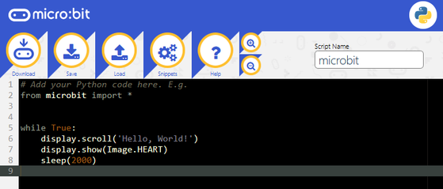

Micro:bit官方在线代码编写平台，使用常用浏览器直接打开上述网址即可使用。

2.  Micro:bit官方也推出了一个离线的编译工具Mu，方便在没有网络连接的时候也可以进行创意和教学

。对于Windows和MAC用户，可以使用独立软件Mu(离线的编译工具)     。 (Mu软件下载链接：<https://codewith.mu/en/download>)

本教程也基于在本地离线模式使用Mu软件作为Python代码编辑器来完成项目实验。

### 3.2 Mu介绍

Mu的官方网站：[<u>https://codewith.mu/</u>](https://codewith.mu/)

Mu是一个面向初学者程序员的Python代码编辑器，它基于教师和学生。获得Mu最简单和最容易的方法是通过Windows或Mac OSX的官方安装程序(Mu不再支持32位Windows)。目前推荐的版本是Mu 1.1.1。建议你们通过每个支持的操作系统的链接更新到这个版本.（注意：micro:bit2.2主板需要MU1.1.1以上的版本才能兼容）

确定版本并且下载Mu安装程序

先了解您的计算机是Windows系统还是Mac OSX系统；再打开资源管理器，鼠标右键点击”此电脑”，并选择属性，了解您的Windows系统是32位还是64位。

查看系统类别，类型将显示在操作系统下，64位系统或者32位系统：

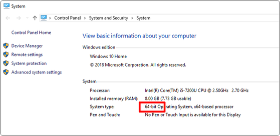

打开链接：<https://codewith.mu/en/download>下载对应的Mu软件版本。

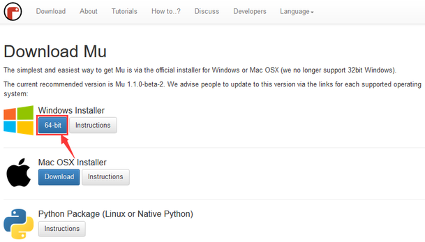

步骤2-运行安装程序：

Mac OSX系统安装Mu方法对应链接：[<u>https://codewith.mu/en/howto/1.1/install_macos</u>](https://codewith.mu/en/howto/1.1/install_macos)

Windows 10 系统

（1）找到你刚刚下载的安装程序（它可能在你的下载文件夹中），双击打开安装程序文件。

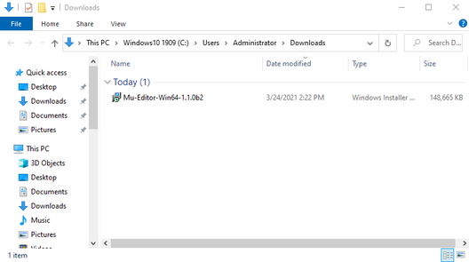

（2）检查许可证，选择复选框并单击“Install”。

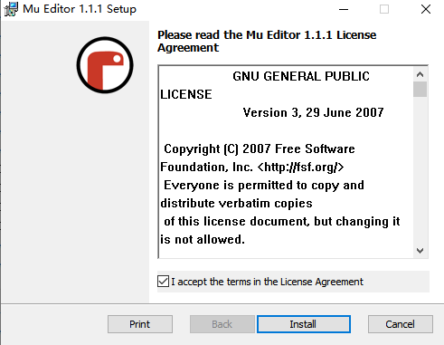

(3)当Mu在你的电脑上安装时，需要几分钟。

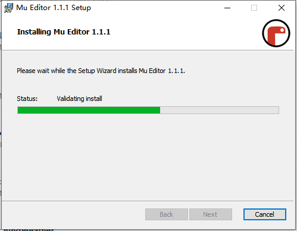

（4）安装已成功完成，请单击“完成”关闭安装程序。

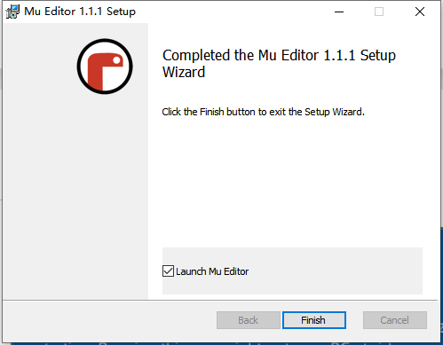

第9步-启动Mu

你可以点击开始菜单中的图标启动Mu，也可以在搜索框中输入Mu(下面两种方法都有显示)。在第一次开始时，这可能需要一些时间。

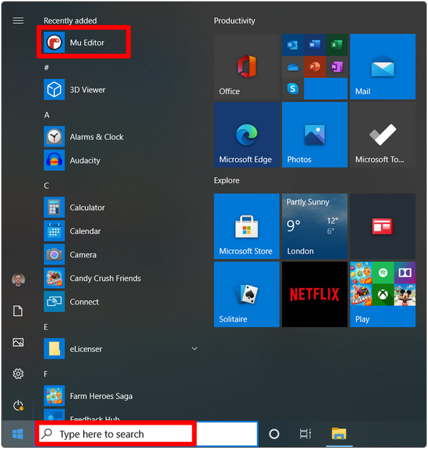

Mu的主界面如下图所示：

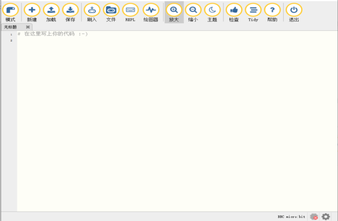

新建程序代码编辑区。

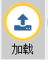
从计算机加载“ py”程序文件。

当您单击“保存”按钮时，该代码将以“ py”格式保存到您的计算机。

您需要确保已连接micro：bit到计算机，当您单击“
刷入”按钮时，代码将在micro：bit上运行（或在

micro：bit点矩阵上滚动看到错误消息）。

当你点击“Files”按钮，可以将电脑上的库文件移到micro:bit上。

当你先点击“REPL”按钮,再按下micro:bit后面的复位按钮，可以读取数字信号或模拟信号等。

 点击“
+”按钮将放大代码字体。

点击“-”按钮将缩小代码的字体。

单击“主题”在白天和黑夜主题之间切换。

编写代码后，单击“检查”按钮进行检查代码。

单击“帮助”按钮将在浏览器中弹出一个页面，该页面将为您提供一些帮助。

单击“退出”按钮关闭Mu软件。 关闭之前，Mu将确保您已保存程序文件。

### 3.3上传第一个程序

实现功能：在micro：bit点矩阵上显示“心型” 图案

1.  通过micro USB电缆将micro：bit连接,选择micro:bit模式

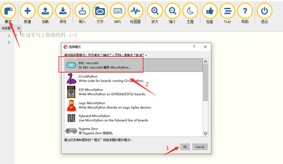

（2）您可以在编辑区域中编写代码，也可以点击加载我们提供的例程程序；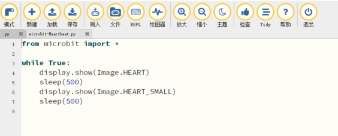

Note:

1 - 必须区分大写字母/小写字母！

2 - 正确拼写!

3 - 诸如＃之类的关键字在内容之间需要一个空格。

4 - 该程序以空白程序结尾.

5 -
与C语言相比，块主体（例如while的主体由缩进标记），Python完全消除了花括号（以及后缀的分号），并使用缩进结构来表示关系。

6 - 使用Tab键（tab）进行缩进。

（3）编写代码后，我们可以单击拇指图标的“检查”按钮来检查我们的代码。

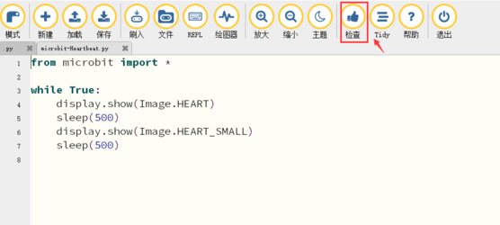

6\. 检查完成后，如果代码没有错误。 您需要单击“刷入”按钮。

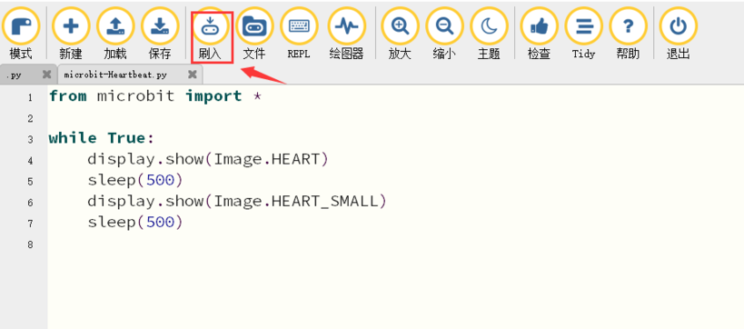

7.  单击“
刷入”后，您可以观察到micro：bit板上的指示灯正在闪烁，表明正在下载程序。
如下图所示。

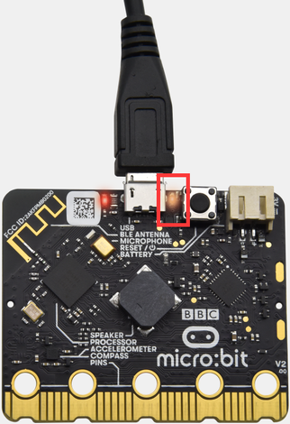

8.  指示灯点亮时，表示程序已成功下载。

9.  此时，您可以看到micro：bit上的LED点阵正在显示跳跃的“ 心型”。
如下图所示。

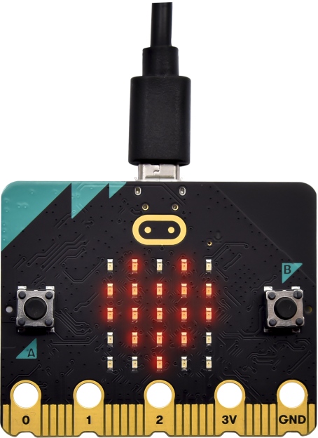
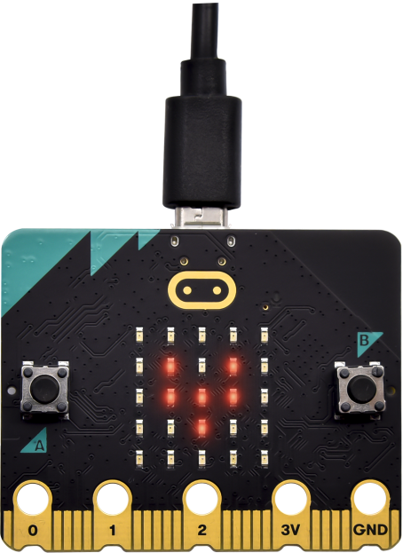
