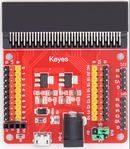
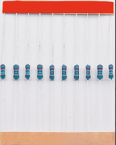
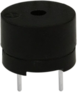
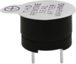
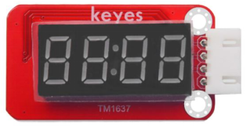
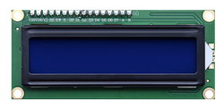

microbit中级学习套件

# 产品说明

micro bit是一款由英国BBC 设计的ARM架构的单片机。它仅有信用卡一半大小，板载蓝牙，加速度计，电子罗盘，三个按钮，5 x 5 LED点阵，麦克风等，主要用于青少年的编程教育。  
为了方便学习micro: bit，我们特别搭配了这个学习套件。套件中包含了LED、蜂鸣器、水位传感器、声音传感器、舵机、LCD显示屏、超声波传感器、数码管等特色的传感器和模块，涵盖了电子系统设计的不同主题。我们还根据这些元件提供了micro: bit的学习课程，课程包含实验原理说明、接线方法，实验代码及说明，让你对这些电子元件和micro: bit有个很好的了解，从简单的单个感应元件实验到复杂的多个元件组合实验，一步步带你玩转micro: bit及学习编程。

# 产品清单

当你收到这个keyes micro bit 中级学习套件时，精美的盒子里产品清单如下：

（注意：KE3041含主板,KE3040不含主板）

|序号|图片|规格|倍用量|
|-|-|-|-|
|1||micro:bit V2.0 主板+官方彩盒包装|1|
|2||keyes micro bit 传感器V2扩展板 红色环保|1|
|3||F5-黄发黄-短 环保|10|
|4||F5-红发红-短 环保|10|
|5||F5-绿发绿-短 环保|10|
|6||F5-全彩RGB雾状共阴|1|
|7||金属膜色环 1/4W 1% 51R 编带 环保|5|
|8||金属膜色环 1/4W 1% 220R 编带 环保|10|
|9||金属膜色环 1/4W 1% 1K 编带 环保|10|
|10||金属膜色环 1/4W 1% 2.4K 编带 环保|8|
|11||金属膜色环 1/4W 1% 10K 编带 环保|10|
|12||无源 12*8.5MM 5V 环保分体 2K|1|
|13||有源 12*9.5MM 5V 环保分体 2300Hz|1|
|14||12*12*7.3MM 四脚 插件 环保|4|
|15||A24 黄帽(12*12*7.3)圆|4|
|16||3386 MU 103（三针直排）针长6.5MM 环保|1|
|17||5516 亮电阻5-10KΩ 暗电阻0.2MΩ|3|
|18||红外接收 5MM 火焰 环保|1|
|19||DS18B20 TO-92 ±0.5℃ 温度传感器 原装|1|
|20||S8050 0.5A/40V TO-92 环保|1|
|21||AETHDX-2801 两脚一样 环保|2|
|22||L293D DIP-16 600mA 四路电机驱动芯片 国产 环保|1|
|23||20*20MM 1.9MM 红色 共阳|1|
|24||一位0.56英寸共阴红 环保|1|
|23||keyes brick TM1637 4位数码管模块(焊盘孔) 防反插白色端子|1|
|26||keyes brick HC-SR04超声波传感器 防反插白色端子|1|
|27||Keyes 2021新款 DIY电子积木 人体红外热释传感器黑色环保（红色端子）|1|
|28||Keyes 2021新款 DIY电子积木 单路5V继电器模块 黑色环|1|
|29||keyes brick 土壤传感器(焊盘孔) 防反插白色端子|1|
|30||keyes brick 水位传感器(焊盘孔) 防反插白色端子|1|
|31||Keyes 2021新款 DIY电子积木 声音传感器 黑色环保（绿色端子）|1|
|32||SG90 9G 23*12.2*29mm 配十字臂 蓝色 辉盛 90度 环保|1|
|33||keyes brick IIC 1602 蓝屏（5V）防反插白色端子|1|
|34||Keyes ULN2003步进电机驱动板 (焊盘孔) 红色环保|1|
|35||Keyes 2021新款 DIY电子积木 MQ-2模拟气体传感器黑色环保（黄色端子）|1|
|36||Keyes 2021新款 DIY电子积木 XHT11温湿度传感器（兼容DHT11）黑色环保（蓝色端子）|1|
|37||Keyes 2021新款 DIY电子积木 摇杆模块 黑色环保（黄色端子）|1|
|38||Keyes 2021新款 DIY电子积木 水滴传感器 黑色环保（绿色端子）|1|
|39||28YBJ-48 DC:5V 4相5线步进电机 线长25CM XH-2.54 5P接口|1|
|40||2节5号 带开关和线-103845+PH2.0线材 总线长210MM|1|
|41||18650双节15CM露线适用DIY小车+插杆|1|
|42||3-6V 13000RPM 130电机+15CM面包线|1|
|43||桨参数：孔径2mm 转动直径：72mm 中间圆帽直径：24mm 叶片长:25mm中间圆帽颜色：黄 环保|1|
|44||ZY-102 830孔 白色（纸卡包装）环保|1|
|45||公对母20CM/40P/2.54/10股铜包铝 24号线BL 环保|1|
|46||XH2.54-3Pin+杜邦母单 长19.5cm (红线在中间)|5|
|47||HX-2.54 4P 转杜邦线母单 26AWG 黑红白棕 200mm|3|
|48||HX-2.54 5P 转杜邦母单 22AWG 黑红棕白黄 200mm|2|
|49||面包板连接线30根 环保|1|
|50||AM/MK5P(micro)黑色 OD：3.5 L=1M PVC过粉|1|
|51||100*70MM|1|
|52||N-240235*160*65MM白色环保|1|

