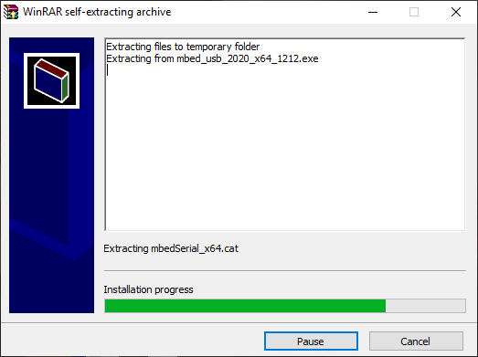
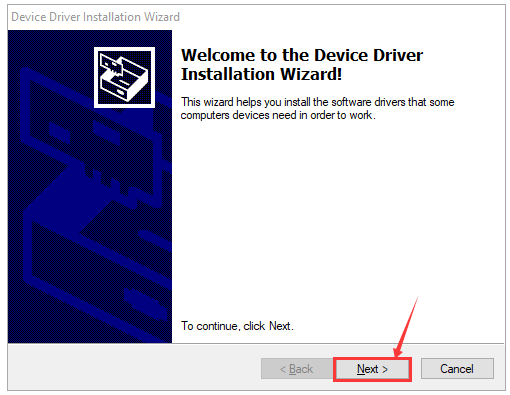
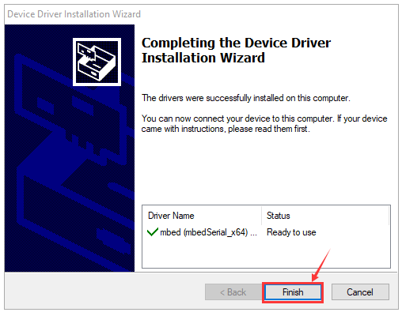

# 安装micro:bit驱动说明书

下面给micro:bit开发板安装驱动。首先将micro:bit主板用micro USB数据线连接到电脑上，然后鼠标左键双击驱动文件，点击Install。

继续点击Install，安装驱动。

先点击“Install”，再点击“Finish”，安装完成。

安装完成后，点击“Computer” —\>“Properties”—\> “Device manager”,我们可以看到下图。

